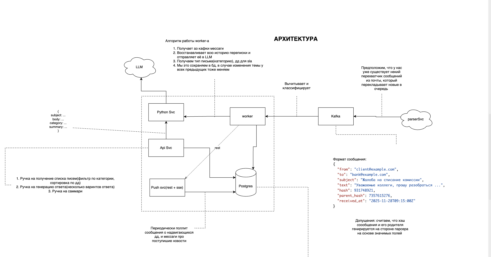

# Требования к системе обработки входящей корреспонденции (обновлённая версия)

## 1. Функциональные требования

### 1.1. Инжест входящих писем

Система должна принимать и сохранять входящие письма:

* поля письма: `from`, `to`, `subject`, `body`, `received_at`;
* загрузка писем через API (`POST /mails`);
* сохранение оригинального текста;
* возможность отправки в Kafka (`incoming-mails`).

### 1.2. Автоматическая классификация

Worker выполняет классификацию письма:

* категории: `complaint`, `info_request`, `regulator`, `partnership`, `approval`, `notification`;
* LLM обрабатывает письмо и записывает результат в БД.

### 1.3. Извлечение ключевой информации

LLM извлекает:

* договоры, счета, суммы;
* сроки, требования, ограничения;
* нормативные ссылки;
* intent отправителя;
* краткое саммари.

### 1.4. Расчёт SLA

Система определяет:

* базовое SLA по категории;
* SLA из письма (если найдено);
* итоговую SLA-дату (`sla_date`);
* уровень срочности.

### 1.5. Хранение писем и метаданных

Система хранит:

* оригинал письма;
* категорию;
* SLA;
* извлечённые данные;
* саммари;
* связи parent/child;
* статус обработки.

### 1.6. Генерация ответа

Система формирует ответы через LLM:

* API: `POST /reply`;
* вход: **только `messageIds[]`** (сервис сам загружает письма из БД);
* формируются разные стили ответов;
* ответы можно сохранять.

Дополнительно:

* `POST /messages` — отправка оператором готового ответа.

### 1.7. REST API

Актуальные методы:

#### Переписки

* `GET /conversations` — список тредов, пагинация через `next`;
* сообщения включаются в ответ.

#### LLM-функции

* `POST /reply` — генерация ответа (вход: `messageIds`);
* `POST /summary` — саммари (вход: `messageIds`);
* `POST /messages` — отправка текстового сообщения.

#### Письма

* `GET /mails`;
* `GET /mails/{id}`;
* `POST /mails`.

#### Уведомления

* `GET /notifications` — список, пагинация через `next`;
* `GET /notifications/stream` — SSE-подписка.

### 1.8. Поддержка Kafka

* входящие письма публикуются в `incoming-mails`;
* worker получает письма, выполняет LLM-обработку и сохраняет результат.

### 1.9. Отчётность

* статистика по категориям;
* приближающиеся SLA;
* логирование работы LLM.

---

## 2. Нефункциональные требования

### 2.1. Масштабируемость

* независимое масштабирование API, worker’ов и LLM.

### 2.2. Надёжность

* Kafka — at-least-once;
* worker перезапускаемы;
* Postgres — основное хранилище.

### 2.3. Производительность

* классификация: 1–2 сек;
* генерация ответа: 2–4 сек.

### 2.4. Логирование и трассировка

* лог всех операций, ошибок и ретраев.

### 2.5. Безопасность

* авторизация;
* неизменяемое хранение оригиналов писем.

### 2.6. Конфигурируемость

* настройки SLA;
* параметры генерации ответов.

### 2.7. Развёртывание

* docker-compose (API, Python svc, worker, Kafka, Postgres);
* локальный режим без Kafka.

### 2.8. Расширяемость

* новые категории писем;
* замена LLM;
* интеграция с почтовыми серверами.

## 3. Архитектура

  

